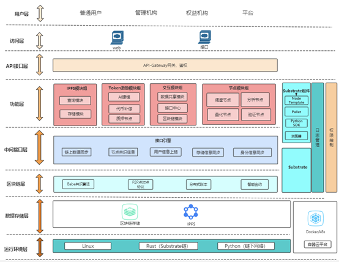
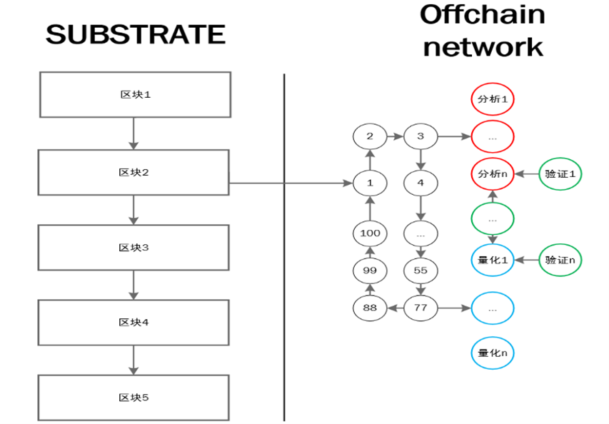
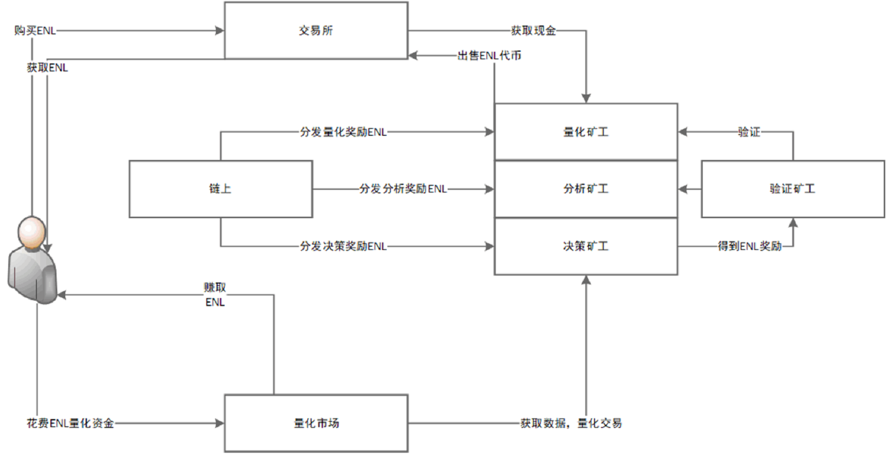
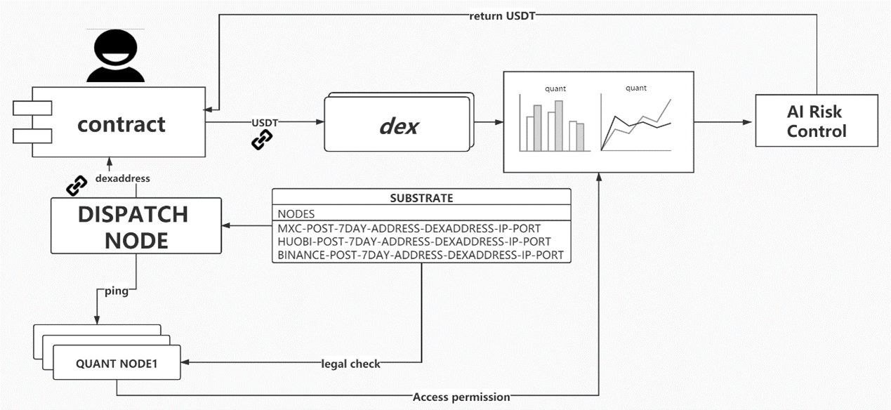

## **Project Background**

​	Blockchain has been developed for more than 10 years since it was created, and now it has been widely used in various industries. Its Bitcoin blockchain network already stores 30GB of data, while Ethereum has a storage consumption of 1TB.For blockchain alone, it is not naturally suited to handle high IO network requests, or business scenarios with strong interactions. For example, the delay of network communication, the time required for block packaging to be linked, and the storage of big data are the problems that the blockchain industry has been facing and urgently worth solving. However, the data on blockchain has not been properly utilized and mined. The inherent financial business scene property of blockchain is an urgent need of modern finance. The popularity of DEFI is justified, and traditional industries such as banks, trust funds, lending and other industries have been severely impacted by DEFI. Defi can effectively solve the pain points of traditional finance.

​	Uniswap is a pioneering solution to the problem of market makers, where everyone can participate in the AMM and profits from traditional, centralised exchanges can be shared without barriers to entry among participants who provide liquidity. Compound lending platform, which obtains liquidity through over-mortgaging tokens, effectively solves the problem of capital turnover of cryptocurrency. The business scenarios of blockchain in the financial field have been gradually improved, and the data value is still worth discussing.

​	Huobi according to incomplete statistics, Binance Okex exchange, such as a day can produce the trading data of hundreds of millions, and spreads between exchanges, in the early days have arbitrage space, with the participation of more and more arbitrageurs, exchanges the encryption of currency prices eventually stable at a reasonable price range. It is worth thinking that blockchain address, transaction transfer and other data are worth our analysis and mining.

​	For ordinary people, it is difficult to read and understand the meaning expressed behind the blockchain data. The impact of the transfer of each address to the token on the whole crypto market requires professional data analysts to analyze and match. For the data analysis of blockchain, there is a naturally high threshold.

## **Eternity labs** **A platform dedicated to blockchain data analysis**

​	Eternity Labs is a blockchain data analysis platform developed based on Substrate. It solves problems such as poor performance of on-chain data processing in blockchain by using off-chain algorithm workmachines, off-chain analysis machines, and off-chain predictors combined with IPFS distributed storage network.

​	The concept of double-layer network node architecture design is proposed. The whole block chain network is divided into on-chain network and off-chain network.

​	It not only ensures the security of the blockchain network, but also takes into account the high performance processing power of the computer when processing data. It is safe, efficient, convenient and can be used out of the box. Any person can easily understand the hidden value of the data stored in the whole blockchain network through this network.

 

## **Off-chain algorithm worker** **The underlying basis**

​	Off-chain algorithm Worker nodes are highly abstracted as modular components.

​	The whole chain is divided into four functional nodes with extensibility, which are data analysis node, quantization node, decision scheduling node and verification node.

​	Data analysis node. Its function is responsible for processing the data in the entire blockchain network, and the results of the data processing are signed and broadcast to other nodes. It can realize the fundamental analysis of cryptocurrency, analysis of the number of addresses, position, token token value prediction, etc.

​	Quantization node. Its function is to accept the entrusted quantification of users' assets, realize the secondary market arbitrage, and provide users with a stable asset preservation and appreciation service. Can effectively avoid users because of market fluctuations and make the wrong decision judgment.

​	Decision scheduling node. Its function is responsible for the dynamic allocation of user orders, summary of the whole network data analysis, quantification of nodes, verification of node data, and make a summary of decisions. Improve the utilization of off-chain networks.

​	Validate nodes. Its function is to retrospectively verify the historical data of data analysis nodes, quantization nodes, decision scheduling nodes and verification nodes, so as to ensure that the whole network has a higher security and avoid nodes from doing evil.

## **Coral DSHT**

​	The CORAL protocol is a Content Delivery Network invented in 2004 by Michael Freedman, Eric Freudenthal and David Nazieres of New York University. The design of CDN is to avoid the bottleneck of Internet transmission, and reduce the network pressure of the content supply server, so that the content can be delivered to the client more quickly and stably. The basic idea of CDN is to deploy some node servers in the network and establish a set of virtual network. In the network, the connection information, delay information, user distance parameters and so on are updated in real time between the node servers, and then the user's request is redirected to the most suitable node server. This has many advantages. First, through the node server transit, the user access to the web page speed is greatly improved; Secondly, the node server will cache the query information of the content server, which also reduces the network load of the content server .Finally, it is possible that the content server may be temporarily offline, so users can also read from the cache in the node server.

​	Coral DSHT is one of the core components of Coral CDN. The Kademlia protocol uses XOR distance, meaning that information is always stored in the nodes closest to XOR. And this does not take into account the actual network conditions, such as latency between nodes, the location of data. This wastes a lot of network bandwidth and storage space. Coral solves this problem. Unlike classic DHT, Coral first evaluates all nodes for their connections and then grades them into several tiers based on round-trip Time (3 tiers in Coral), L2(&lt;20 ms), L1 (& lt;60ms), L0 (other).Coral also provides two operation interfaces, PUT and GET, for adding and finding a key-value pair to determine which level of DSHT to query from. We will describe how this is implemented in more detail later.

​	Coral DSHT (Distributed Sloppy Hash Table) is suitable for soft state key-value pair retrieval, that is, the same Key may hold multiple values. This 	mechanism maps the given Key to the address of the Coral server in the network. For example, you can use DSHT to query a domain name server close to the user. Query a server that has cache information for a particular website; Locate surrounding nodes to minimize request latency.

​	**1. Indexing and layering**

​	Coral also has a special handling of routing tables, with each Coral node placed in a different DSHT depending on their latency properties. Nodes with the same DSHT are called clusters, and each Cluster has a maximum delay time known as the Cluster Diameter. And the whole system will be pre-set a diameter, called the Level. At each level, each node is a member of a DSHT.A group of nodes can only become a cluster if they meet a limit of two with diameters less than the it level. In Coral, DSHT is divided into three layers: level-2 corresponds to pairwise delay less than 20 milliseconds, level-1 corresponds to pairwise delay less than 60 milliseconds, and level-0 corresponds to all other nodes. Coral, when asked, also prioritizes the node with higher ranking and shorter corresponding time. If this fails, the request is made in the next node. Such a design not only reduces the latency of the query, but also makes it more likely to get the data returned by neighboring nodes first.

​	**2. Key-value pair based routing layer**

​	Coral's key-value pair, like Kademlia, is calculated by SHA-1 hashing and has 160bits.The ID of each node is calculated from its IP address via SHA-1.Here we can save a <; with the PUT directive.Key, Value&gt;Yes, to show that Key and Value are close; You can also use the GET directive to find out how far and near the nodes are for the same Key. 

​	**3. Sloppy storage**

​	In the Kademlia protocol, data is stored directly to nodes closer to XOR. But the reality is that if some data is very Hot, other nodes will also get a lot of queries, and this will cause congestion, which we call a hot-spot; At the same time, a cache key-value pair stores too many values, which is called a tree-saturation. Sloppy storage is designed to avoid both of these situations.

​	Each Coral node definition has two exception states, Full and Loaded. Full state is defined as: at the current node R, L < already exist;Key, Value&gt; Pair such that Key=k, and the lifetime of the L key-value pairs is greater than 1/2 of the new value. The Loaded state is defined as having received more than a specific number of requests in the past minute for a given Key=k.

​	Coral then performs a storage operation in two steps.

​	Step 1 is a forward query. Coral will continue iterating to find the node ID closer to the Key, exactly like the Kademlia protocol. Each node returns two pieces of information. First, whether the node is loaded or not. Second, for the Key, how many values are stored in this node and how long each Value is in effect. Based on the information received, the client decides whether the nodes can store new values. The process of looking forward continues until the client finds a connectable node closest to the Key value. If an exception is queried against a node, that node will not continue iterating the query. The joinable nodes will be pushed onto the stack one by one.

​	Step 2 is a reverse query. From step 1, the client gets a list of nodes that can be stored. Then try to add < in order of distance Key from near to far; Key, Value&gt;I'm going to go to these nodes. If the operation fails, such as when another node is inserted at this point and the node becomes FULL, the client abandons storing the node, pops it off the stack and tries the next node until it is successfully stored

​	Coral DSHT protocol to ensure the security and reliability of the entire chain node network, data analysis node, quantification node, decision scheduling node, verification node communication between nodes through Coral DSHT protocol to ensure the efficient communication between nodes. We will still consider the future compatible multi-version off-chain network communication protocol to ensure the security of the network.

## **OAW Protocol stack**

​	Off-chain algorithm worker distributed off-chain network, OAW provides a platform to support deployment and writing, and can support the update and version management of various functional codes. The OAW protocol is responsible for six different functional sub-protocols, as follows:

- Identity layer: manages the generation and authentication of nodes.

- Network layer: manages the links of other nodes, using a variety of underlying network protocols

- Routing layer: maintains node routing information in a distributed hash table (DHT) to locate specific peer nodes and objects.

- Respond to query requests from local and remote node points.

- Policy layer: manage the results of data analysis of each node, and send relevant instruction scheduling

- Functional layer: provides quantitative and analytical support in the form of modules

- File layer: responsible for the management of OAW code files, similar to Git version management

## **Project value of ENL**

​	With the advancement of the technology, a large amount of blockchain data is produced every day, and the data grows exponentially every year. The application of the new generation of blockchain technology will definitely promote a new world pattern. The world is truly digitized. Data analysis requirements for data and computing power will be the bottleneck restricting blockchain in the data analysis market.ENL was born to solve the problem of blockchain data analysis. It is hoped that the ENL incentive system can greatly reduce the maintenance cost of nodes and improve the security benefits of data storage. The financial essence of ENL is actually the sharing economy, which provides more efficient storage devices and networks around the world and makes it possible to reduce the cost of data analysis modeling and quantification.

## **ENL economic system**

​	The design of ENLCOIN economic system is an important part of the whole project.

​	The robustness of the design of the economic system directly determines whether the project can run for a long time.

​	ENL is the circulation token of the entire system, and users pay for ENL tokens to obtain quantified services.

​	The quantization node provides quantization support and obtains service fee.

​	A constant issue of 100 million ENL tokens

 

## **Decentalized Quantitative Scheduling Network Protocol**

​	Decentalized Quantitative Scheduling Network Protocol (DQSNP) is mainly responsible for the work and implementation of each sub-protocol node. DQSNP plays a role in the management and communication of the entire ENL network, and is the coordination center of ENL protocol. Three basic operations are provided: PUT, GET, and MANAGE. Users and miners do not need to pay attention to the internal design of the blockchain when using ENL. They only need to simply call three interfaces.

​	DQSNP is the protocol that the ecological plate on the ENL chain is responsible for scheduling, so its position is particularly important.

​	The DQSNP protocol is responsible for linking the Substrate Network, assigning tasks to each analysis node, scheduling the quantization node, and acting as a central hub in the whole Offchain.

​	DQSNP is the brain under the ENL chain. DQSNP functions are as follows:

- Assign tasks to data analysis nodes, and make statistics on the performance of tasks of each node.

- Accepts the order entrusted by the user on the chain. If it is a data analysis order, the task will be assigned to 3 random idle nodes for execution, and the result will be returned.

- Accepts the quantitative transaction orders entrusted by users on the chain, and randomly assigns tasks to one set of quantitative nodes for execution, and returns the results.

- Collect the profit and loss of each quantization node

- Collect the self-pledge of each quantized node to quantify the fund situation

- Statistics and find the online status of each data analysis node

- Statistics and find the online status of each verification node

- Updates the global status every 1 minute

 

​	DQSNP is the central scheduling node under the chain, so DQSNP also has its unique consensus algorithm to maintain the whole network.

​	DQSNP nodes are generated by candle auction, and the top 100 nodes have the right to participate in scheduling and can receive ENL rewards.

​	For security reasons, participating in the auction requires pledging ENL.

​	At the same time, in order to be more conducive to the development of the ecology, 50% of pledged tokens will be released after the second round of auction, and the subsequent pledged tokens will be released in 180 days.30% of the ENL generated by mining will be released immediately, and the remaining tokens will be released linearly within 30 days. The whole process is done on an smart contract.

## **Loss of mining**

​	In the process of quantification, losses are inevitable. In the project design, green environmental protection and sustainable development of the project are important issues we consider. Quite different from Bitcoin and Ethereum, ENL does not use PoW or PoS as mining generation. In the first stage, the Substrate Consensus algorithm uses DPOS to ensure that the node control is within reasonable limits. Moreover, each block generates different revenue. The number of ENL tokens generated should be related to the actual market value of the project. Therefore, each revenue can be divided into reasonable profit tokens by verification node, analysis node, quantization node and scheduling node. The number of ENL word blocks produced is generated by the negative revenue generated by the users participating in the quantization node. The weighted average of the tokens obtained by the user for a single account is the compensation income obtained. And the profit generated by quantification, 5% to 10% of the profit is collected by the relevant nodes, and the state Treasury. Let's take this as an example. If user Jim quantifies a fund of $10,000 and gets an average return of $5,000 over the course of a year with an annualized rate of 50%, then the service fee he needs to pay should be $250-500.And if you have a negative interest rate, which is $10,000, you're going to lose $2,000 a year. After a period of confirmation of the whole network block, his quantized account can be compensated with ENL tokens. Obviously, for users who hold ENL or quantized for a long time, his final profit will become very considerable. As long as ENL keeps optimizing the algorithm model, we can achieve hematopoiesis in the real sense.

 

## **Two-tier network architecture**

​	The ENL architecture is designed as a two-layer network, which is divided into substrate on-chain network and off-chain network.

​	The on-chain network adopts DPOS algorithm to improve the throughput of the whole blockchain network.

​	Offchain under chain network uses DQSNP protocol network to schedule distribution, to ensure the security and reliability of off-chain network

## **Miner's income structure**

​	In the ENL economy, the benefits are different at different nodes.

​	There are 3 benefits for miners in the ENLCOIN ecosystem.

- Revenue from new coin issuance: DPOS miners, who receive new coin issuance from the ENL system by generating blocks, which is similar to the EOS economic model.

- Quantification Service Revenue: Miners receive transaction fees and subsidy of new currency by providing relevant quantification, analysis, verification and other services.

- Quantified Market Returns: Miners are rewarded by ENL for quantifying funds in the secondary market to generate negative interest rates.

 

​	For DPOS miners, the payoff is single, and only the block payoff generated on the Substrate chain is available.

​	For the quantitative node and the quantitative market, it can get a variety of benefits. If more and more people participate in the process of quantitative trading, the benefits will also increase in direct proportion.

​	Thus, we can understand the three sources of miners' income in the ENL economic system.

​	The economy has repaired itself in the long run through the interests of all parties, with the aim of creating a more robust distributed quantitative network.

## **Quantitative process design architecture**

​	After the user deposits quantized assets into the smart contract, the dispatching node and Substrate detect the entire node that is qualified for quantization, authorize its address to the contract address, and transfer it to the relevant address.

​	After the quantization node obtains the USDT, it can use this token for the profit of the relevant model.

​	Finally, through risk control to control the withdrawal rights, and can only transfer to the original address.

​	Eventually, smart contracts allocate assets to different user accounts based on profit and loss.

