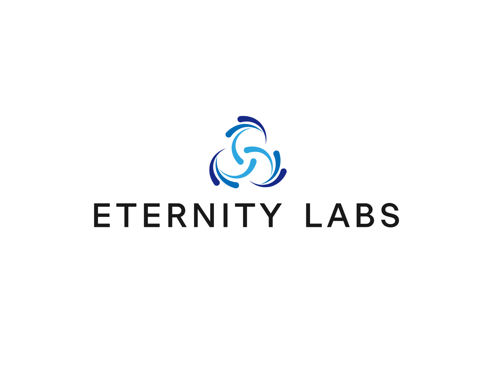

# EternityLabs Network

<p align="center">
  
</p>


## 1. Build

Install Rust:

```bash
$ curl https://sh.rustup.rs -sSf | sh
```

Initialize your Wasm Build environment:

```bash
$ ./scripts/init.sh
```

Build Wasm and native code:

```bash
$ cargo build --release
```


## 2. Run

Start a development chain with:

```bash
$ cd EternityNetwork
$ ./target/debug/node-template --dev --tmp
```