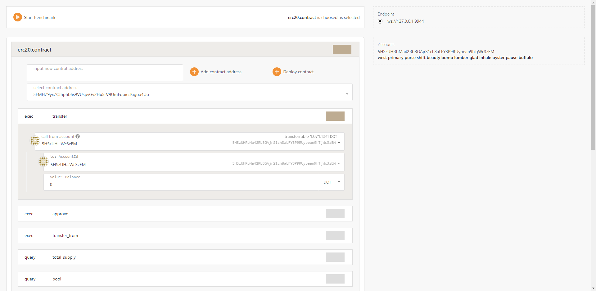
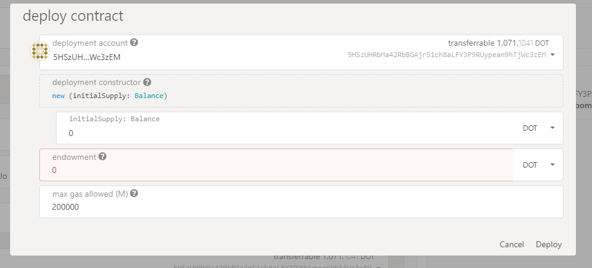
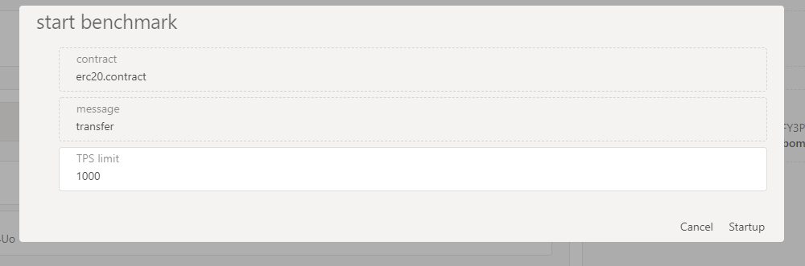

## 安装命令行工具
```
yarn add wasmark -g
//
yarn add wasmark
```

## 启动命令行工具
```
[wasmark | npx wasmark] -d [.contract文件所存放的路径] -e [节点] -m [助记词 多个] -c [合约文件路径] -p [端口]
```
需准备好在部署节点有余额的助记词。假如 /projectA/artifacts/ 目录下存在.contract合约文件，则可以按以下方式调用
```
wasmark -d /projectA/artifacts -m 'seed xxx seed' -e 'ws://127.0.0.1:9944'
```
默认使用4000端口，启动后在浏览器访问 *localhost:4000* 。

## UI界面
1. 主界面：合约列表展示，合约方法选择，调用参数输入。


2. 合约部署页：如果合约未部署，可通过该界面部署


3. 压测选项页：选择测试选项，目前仅支持TPS


4. 测试结果页：待完善

