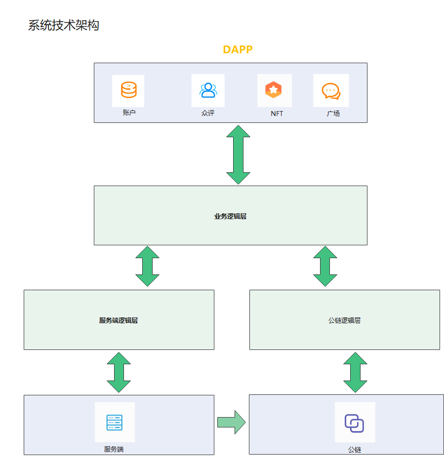
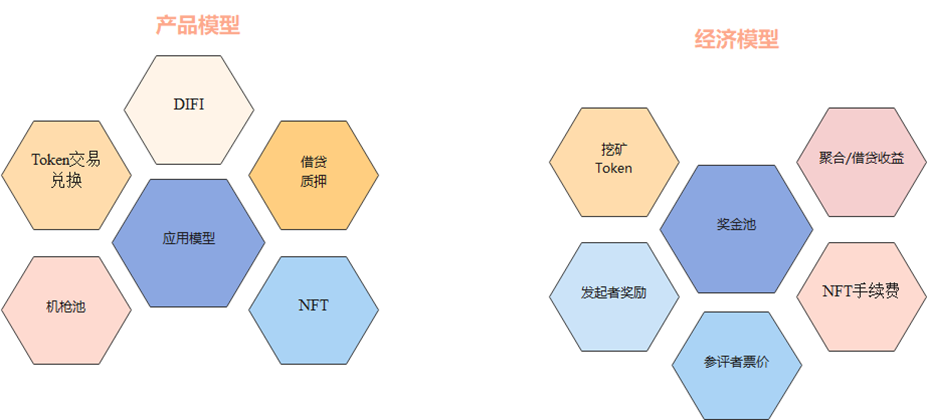

## 基本资料

项目名称：众评链（PubComentsChain）
项目成立日期: 2021.06

## 项目整体简介

众评链是一个全新原创的去中心化影视评定平台。为了解决传统中心化影视评定无法实现客观、公正的根本性难题，我们引入了客观因子并设计了一套算法模型，在该算法模型及区块链特点的加持下，
系统能够很好的解决传统中心化影评系统的问题。在实现该应用的核心功能后，我们基于此作为切入点加入影视相关NFT模块、DEFI模块及相关社交功能（后面还会涉及DAO模块），实现制片方/演员/影迷
的电影IP数字化平台，希望打造出一个基于影视相关生态的区块链项目。

 

## 项目特色

影视分值评定中引入价值因子（票房预测），使大众在评定影视作品时基于算法规则能够有效的实现更加客观公正的进行。相较于目前市面上主流的过于主观号好恶评分算法，它不但能让大众在有奖励机制的刺激下大大改善影评整体的恶意评分、抱团刷分的现象，还能更加客观公正的体现一个影视作品的优劣。算法中引入票房预测，本质上就是加入了一个除了主观评定分以外，另一个影视价值评定分作为算法价值因子。价值因子在获得大众最终影视评分过程中能够对不合理的评分（比如恶意抬高、恶意差评等）进行适当的弱化，并能大大降低这种不合理现象的出现。整个算法分为两部分，影视评分获得算法及奖励机制算法。影视评分算法的核心作用是获得获得大众给出的客观合理的影视作品评分。奖励机制算法的作用是对在影视评分中成员表现的优劣进行评定，后续如果进行奖励时可以作为依据。

### 项目架构

 

### 项目模型

## 黑客松期间计划完成的事项

### **区块链端**

1、token合约的创建及相关转账函数的实现

2、链评发起期流程实现

3、链评评分期流程实现

4、评价算法实现

### **客户端**

1、账户登录流程的实现

2、评定活动参与流程的实现

3、网页主要布局页面的实现

4、广场社交界面设计及实现

5、NFT界面设计及实现

6、网络服务端业务接口实现

## 队员信息

唐林峰（https://github.com/tlf1234）

季齐（https://github.com/wsjq5477）

黄龙 (https://github.com/CorleoneH)

