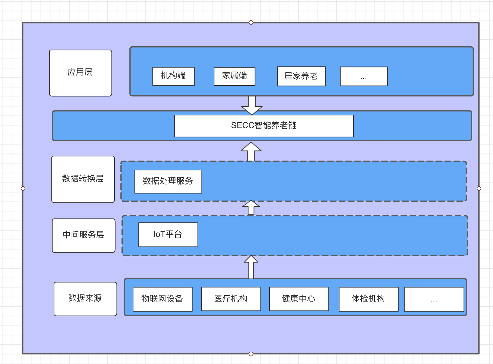

## 基本资料

项目名称：Smart Elderly Care Chain

项目立项日期 (哪年哪月)：2021年6月

## 项目整体简介

- **Smart Elderly Care Chain**的愿景是基于substrate框架开发、利用区块链技术的不可篡改、可追溯、高透明等特性;
  将医院、疗养机构、医生、药品配送企业、保险机构、社保部门、可穿戴设备和老人连成一个数据网，根据链上共享数据制定个性化养老方案，从医、食、住、行等方面全方位保障养老服务质量，
  便捷地为老人提供一站式健康管理多方共赢的“区块链+养老”服务体系，让今天的老人和明天的自己老有所养、老有所医、老有所乐、老有所安。

- 项目 logo

  
- 系统架构
  

  
## 黑客松期间计划完成的事项

**区块链端**
- `联盟链`
  - [ ] 构建许可网络 - 新的节点需要经过批准才可以加入到网络
  - [ ] 用户级别的权限管理 - 使用白名单机制，只有白名单用户可以发送交易，可以结合sudo和其它的治理模块增加删除白名单用户。
  - [ ] 通过治理添加或者删除验证人节点

- `pallet-sign-data` 体征数据存储pallet
  - [ ] 聚合体征数据存储
  - [ ] 睡眠报告数据存储

- `pallet-health-ai` 健康管理pallet
  - [ ] 慢性病存储
  - [ ] B超、体检报告等文件存证
  - [ ] 慢性病和菜品禁忌关联存储
  - [ ] AI识别菜品关联慢性病结果

**客户端**

- web
  - [ ] 用户钱包注册登录页面
  - [ ] 用户绑定设备页面
  - [ ] 用户慢性病维护页面
  - [ ] 用户睡眠、心率呼吸报表
  - [ ] 用户餐品上传并识别
  - [ ] 用户餐饮提醒(推荐、禁忌、用餐上传结果分析)
  - [ ] 体征报告查询
  - [ ] 医疗报告查询
  - [ ] 推荐膳食查询

**后端**

- 链下后台服务
  - [ ] 后台服务（设备厂家、医疗机构、IOT、IPFS数据对接）
  - [ ] 通过go-sdk把设备、医疗数据、IPFS数据链上存证
  - [ ] 阿里云IOT物联网平台对接
  - [ ] 百度AI菜品识别

## 黑客松期间所完成的事项

**区块链端**
- `联盟链`
  - [ ] 构建许可网络 - 新的节点需要经过批准才可以加入到网络
  - [ ] 用户级别的权限管理 - 使用白名单机制，只有白名单用户可以发送交易，可以结合sudo和其它的治理模块增加删除白名单用户。
  - [ ] 通过治理添加或者删除验证人节点

- `pallet-sign-data` 体征数据存储pallet
  - [x] 聚合体征数据存储
  - [x] 睡眠报告数据存储

- `pallet-health-ai` 健康管理pallet
  - [x] 慢性病存储
  - [x] B超、体检报告等文件存证
  - [x] 慢性病和菜品禁忌关联存储
  - [x] AI识别菜品关联慢性病结果

**客户端**

- web
  - [x] 用户钱包注册登录页面
  - [x] 用户绑定设备页面
  - [x] 用户慢性病维护页面
  - [x] 用户睡眠、心率呼吸报表
  - [x] 用户餐品上传并识别
  - [x] 用户餐饮提醒(推荐、禁忌、用餐上传结果分析)
  - [x] 体征报告查询
  - [x] 医疗报告查询
  - [x] 推荐膳食查询

**后端**

- 链下后台服务
  - [x] 后台服务（设备厂家、医疗机构、IOT、IPFS数据对接）
  - [x] 通过go-sdk把设备、医疗数据、IPFS数据链上存证
  - [ ] 阿里云IOT物联网平台对接
  - [x] 百度AI菜品识别

- 7月5日前，在本栏列出黑客松期间最终完成的功能点。
- 把相关代码放在 `src` 目录里，并在本栏列出在黑客松期间打完成的开发工作/功能点。我们将对这些目录/档案作重点技术评审。
- 可选：放一段不长于 **5 分钟** 的产品 DEMO 展示视频, 命名为 `团队目录/docs/demo.mp4`。

## 队员信息

产品：肖慧(Sean)

前端： 龙春雨(Rain) 吴迪(Luffy)

后端：
唐先杰(Zorro) 童磊(Eric) 胡明旺(dsghmw) 陈山资(action) 宁天阳(Robin)

UI： 龙春雨(Rain)

测试： 王海蓉(Lotus)

