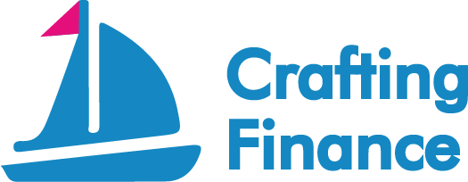

## 基本资料

项目名称：Crafting Finance

项目立项日期：2021年4月

## 项目整体简介
Crafting Finance 是一个基于 Polkadot 的合成资产发行协议和去中心化合约交易所，支持包括波卡（DOT），Kusama （KSM），比特币（BTC），以太坊（ETH）等多种质押品，通过智能合约和预言机合成发行加密资产，如股票，债券，黄金，或各种链下资产等。用户可以通过铸造某种合成资产（如美元），将自动持有该资产的多头头寸。用户也可以通过交易平台将铸币资产转换为其他资产，从而实现做空资产，做多其他资产的目的。所有用户所铸造的资产对应着整个系统的负债，在铸造时确定了每个用户负债的比例，从而可以计算出他们各自的利润。由于该质押物池模型不需要对手盘，它完美的解决了去中心化交易所（DEX）的流动性和交易深度问题。

## Demo 实现功能点

**forge 铸造中心**

- 抵押资产并发行多种类合成资产(`fn forge()`)
  - [ ] 加入债务池，调用合约 debtpool 的 join 方法
  - [ ] 不加入债务池，调用合约 accountbook 的 mint 方法

**kingsman 合约交易所**

- 交易合成资产(`fn swap()`)
  - [ ] 债务池中的资产，调用合约 debtpool 的 swap_in_sdp 方法
  - [ ] 非债务池中的资产，调用合约 accountbook 的 swap 方法，以及调用合约 debtpool 的 swap_not_in_sdp 方法

**debtpool 共享债务池**

- 查询某种合成资产的数量(`fn get_asset_amount()`)
- 查询某种合成资产的价值(`fn get_asset_value()`)
- 查询债务池资产总价值(`fn get_asset_total_value()`)
- 查询某用户的某种合成资产的数量(`fn get_user_asset_amount()`)
- 某用户的合成资产的总价值(`fn get_user_asset_total_value()`)
- 某用户的债务比例(`fn get_user_debt_ratio()`)
- 某用户的利润(`fn get_user_profit()`)
- 铸造合成资产并加入债务池(`fn join()`)
- 债务池中的合成资产交易(`fn swap_in_sdp()`)
- 非债务池中的合成资产与债务池中的合成资产的交易(`fn swap_not_in_sdp()`)

**accountbook 非债务池的合成资产账本**

- 查询某种合成资产的数量(`fn get_asset_amount()`)
- 查询某种合成资产的价值(`fn get_asset_value()`)
- 查询账本资产总价值(`fn get_asset_total_value()`)
- 查询某用户的某种合成资产的数量(`fn get_user_asset_amount()`)
- 某用户的合成资产的总价值(`fn get_user_asset_total_value()`)
- 铸造合成资产(`fn mint()`)
- 交易合成资产(`fn swap()`)

**whitelist 系统资产白名单**

- 系统可抵押资产(`fn get_collateral_asset()`)
- 系统可合成资产(`fn get_synthetic_asset()`)
- 系统资产的杠杆率区间(`fn get_leverage_ratio()`)

**aggregator 模仿预言机功能**

- 喂价(`fn feed_price()`)
- 读取价格(`fn get_price()`)

## Demo 演示脚本
为方便计算演示，假设当前ETH价格为$3000，DOT价格为$25，CRF价格为$5。ETH的抵押率为150:100，DOT的抵押率为200:100，CRF的抵押率为500:100。此外，Crafting平台支持1-10倍杠杆。

1. Alice将1个ETH（价值$3000）在Forge中进行抵押，使用3倍杠杆铸造成3个rETH（价值$9000）加入债务池。

债务池总债务是$9000，Alice个人负债比例100%。

Alice有3个rETH（价值$9000），且Alice在债务池中。

2. Bob将4个DOT（价值$100）在Forge中进行抵押，使用10倍杠杆铸造成1000个rUSD（价值$1000）加入债务池。

债务池总债务是$10000，Alice个人负债比例90%，Bob个人负债比例10%。

Alice有3个rETH（价值$9000），且Alice在债务池中。
Bob有1000个rUSD（价值$1000），且Bob在债务池中。

3. Dave将1000个CRF（价值$5000）在Forge中进行抵押，借出1000个rUSD（价值$1000），不加入债务池。

债务池总债务是$10000，Alice和Bob个人负债比例不变。

Alice有3个rETH（价值$9000），且Alice在债务池中。
Bob有1000个rUSD（价值$1000），且Bob在债务池中。
Dave有1000个rUSD（价值$1000），且Dave不在债务池中。

4. Alice将1个rETH（价值$3000）在Kingsman中换成2000个rUSD（价值$2000）和40个rDOT（价值$1000）。

债务池总债务是$10000，有2个rETH（价值$6000），3000个rUSD（价值$3000），40个rDOT（价值$1000）。Alice和Bob个人负债比例不变。

Alice有2个rETH（价值$6000），2000个rUSD（价值$2000），40个rDOT（价值$1000），且Alice在债务池中。
Bob有1000个rUSD（价值$1000），且Bob在债务池中。

5. Dave将1000个rUSD（价值$1000）在Kingsman中换成40个rDOT（价值$1000）。

债务池总债务是$10000，有2个rETH（价值$6000），2000个rUSD（价值$2000），80个rDOT（价值$2000）。Alice和Bob个人负债比例不变。这里需要注意，因为产生了40个rDOT（价值$1000）给债务池带来的价值-$1000的rUSD。

Alice有2个rETH（价值$6000），2000个rUSD（价值$2000），40个rDOT（价值$1000），且Alice在债务池中。
Bob有1000个rUSD（价值$1000），且Bob在债务池中。
Dave有40个rDOT（价值$1000），且Dave不在债务池中。

6. DOT价格上升到$50。

债务池总债务是$12000，有2个rETH（价值$6000），2000个rUSD（价值$2000），80个rDOT（价值$4000）。Alice和Bob个人负债比例不变。

Alice有2个rETH（价值$6000），2000个rUSD（价值$2000），40个rDOT（价值$2000），且Alice在债务池中。
Bob有1000个rUSD（价值$1000），且Bob在债务池中。
Dave有40个rDOT（价值$2000），且Dave不在债务池中。

Alice个人负债 12000 x 90% = $10800，个人资产 $10000，虽然Alice个人资产增长了$1000（10000 - 9000），但是实际亏损了$800（10000 - 10800）。
Bob个人负债 12000 x 10% = $1200，个人资产$1000，因此亏损了$200（1000- 1200）。
Dave个人负债是0，个人资产$2000（40 x 50），因此赢利了$1000（2000 - 1000）。

7. DOT价格下跌到$20。

债务池总债务是$9600，有2个rETH（价值$6000），2000个rUSD（价值$2000），80个rDOT（价值$1600）。Alice和Bob个人负债比例不变。

Alice有2个rETH（价值$6000），2000个rUSD（价值$2000），40个rDOT（价值$800），且Alice在债务池中。
Bob有1000个rUSD（价值$1000），且Bob在债务池中。
Dave有40个rDOT（价值$800），且Dave不在债务池中。

Alice个人负债 9600x 90% = $8640，个人资产 $8800，虽然Alice个人资产减少了$1200（8800 - 10000），但是实际赢利了$160（8800- 8640）。
Bob个人负债 9600 x 10% = $960，个人资产$1000，因此赢利了$40（1000- 960）。
Dave个人负债是0，个人资产$800（40 x 20），因此亏损了$200（800 - 1000）。
